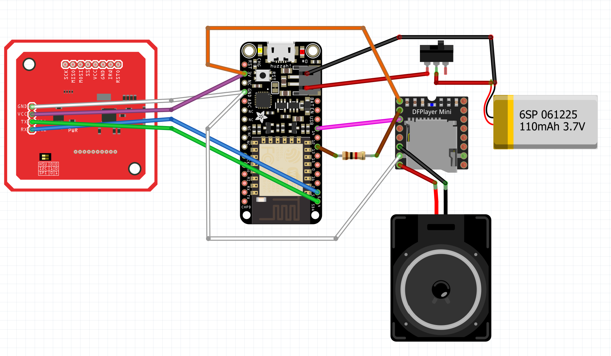

# Music-Box: NFC-Driven Music Player

An interactive music player that uses NFC cards to control playback. Perfect for children or interactive installations where physical objects trigger audio content.

This project is a fork of [Wilksy's Asher Music Box](https://github.com/wilksy/Asher-Music-Box), originally described in the ["Tiny Tonie" blog post](https://wilksy.com/tiny-tonie/). The original project was created as an alternative to commercial "Toniebox" audio players, focusing on providing a more affordable and customizable solution.

## Features

- Play audio tracks by tapping NFC cards
- Control volume with special NFC cards
- Musical Chairs mode that randomly pauses music
- End-of-track detection via DFPlayer's busy pin
- Multiple card detection warning
- Customizable sound effects for different actions

## Hardware Components

- [Fresh'n Rebel ROCKBOX CUBE](https://www.amazon.fr/Enceinte-Bluetooth-Rockbox-Fabric-arm%C3%A9e/dp/B0173HSDJW)
- [Adafruit Feather HUZZAH with ESP8266](https://www.adafruit.com/product/2821)
- [PN532 NFC/RFID Reader Module](https://www.banggood.com/PN532-NFC-RFID-Module-V3-Reader-Writer-Breakout-Board-For-Android-p-1213484.html)
- [DFRobot DFPlayer Mini](https://www.digikey.co.uk/product-detail/en/dfrobot/DFR0299/1738-1041-ND/6588463)
- MicroSD card for audio storage
- 3.7V LiPo battery
- 3D printed case (STL files included)

## Project Setup

### PlatformIO Setup

This project uses PlatformIO for easy dependency management and deployment:

1. Install [Visual Studio Code](https://code.visualstudio.com/)
2. Install the [PlatformIO extension](https://platformio.org/install/ide?install=vscode)
3. Clone this repository
4. Open the project folder in VS Code
5. Build and upload using the PlatformIO toolbar

### Arduino IDE Setup

If you prefer Arduino IDE:

1. Rename `main.cpp` to `main.ino`
2. Install required libraries through the Library Manager:
   - DFRobotDFPlayerMini
   - PN532_I2C
   - PN532

### Wiring

Connect components as follows:

| ESP8266 | PN532 NFC | DFPlayer Mini |
|---------|-----------|---------------|
| 3.3V    | VCC       | -             |
| GND     | GND       | GND           |
| SDA     | SDA       | -             |
| SCL     | SCL       | -             |
| 3.3V    | -         | VCC           |
| GPIO14  | -         | RX            |
| GPIO13  | -         | TX            |
| GPIO16  | -         | BUSY          |

## Audio File Setup

1. Format a microSD card as FAT32
2. Create folders:
   - `/01` for system sounds (connect, disconnect, error sounds)
   - `/02` for music tracks
3. Add MP3 files numbered sequentially (001.mp3, 002.mp3, etc.)

## NFC Card Configuration

Edit the `cards.h` file to register your NFC cards:

- Control cards: Volume control, Musical Chairs mode toggle
- Track cards: Each triggers a specific audio track

To add cards, scan them with the device while monitoring the serial output, then add their IDs to the appropriate array in `cards.h`.

## 3D Printed Case

STL files for enclosure components are included in the `/docs/stl` directory. The design is compatible with a "rebel rock and roll cube" with internal components replaced.

## License

[MIT License](LICENSE)

## Acknowledgements

- Based on the "Asher Music Box" project by [Wilksy (2020)](https://wilksy.com/tiny-tonie/)
- Original project repository: [github.com/wilksy/Asher-Music-Box](https://github.com/wilksy/Asher-Music-Box)
- Updated with PlatformIO support and library improvements
- Enhanced with additional documentation and code
